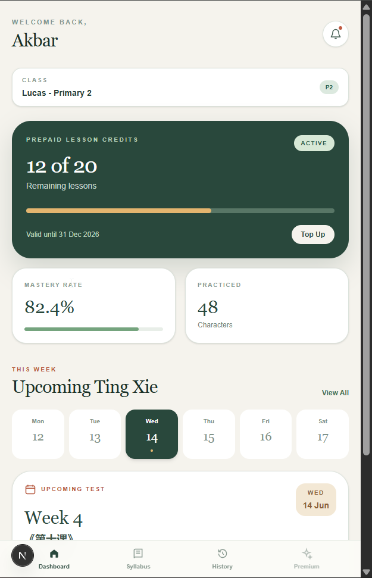
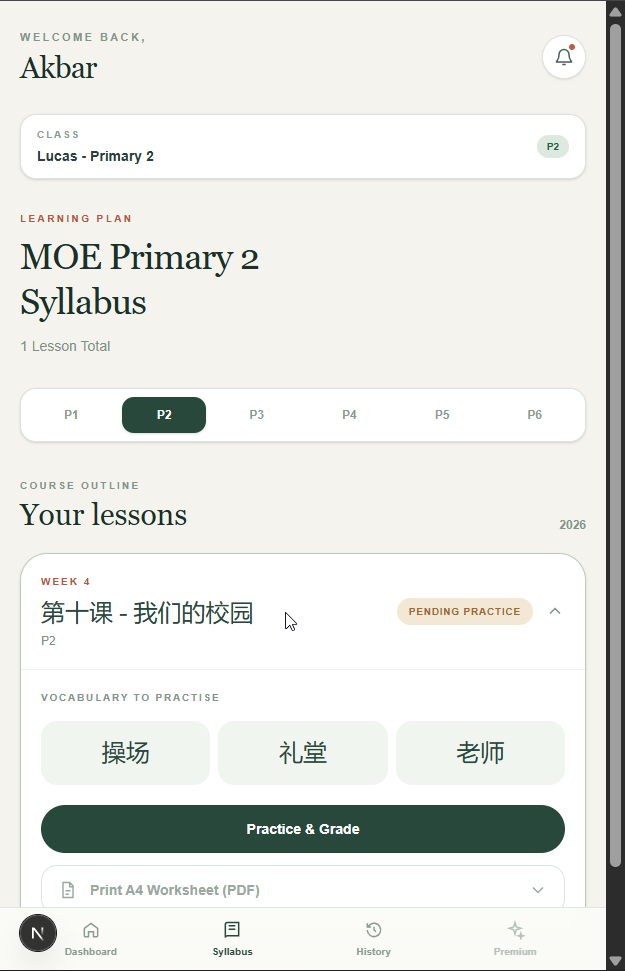
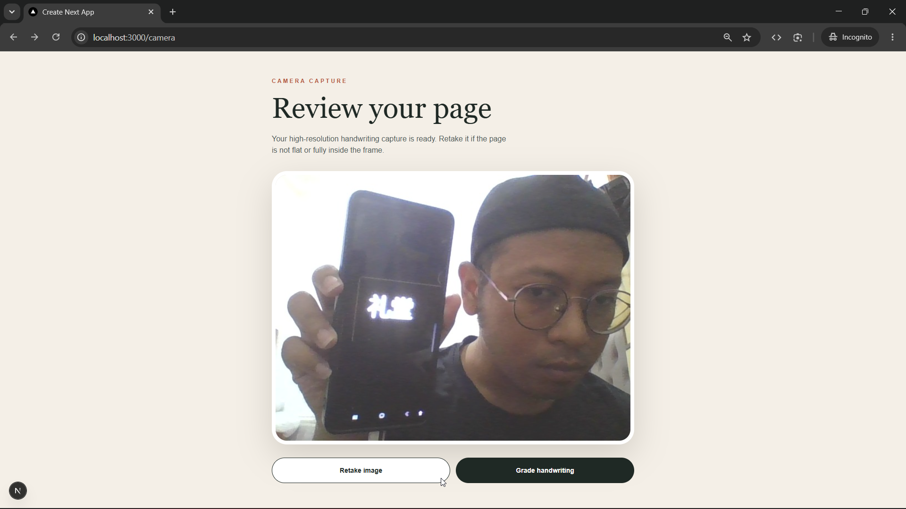
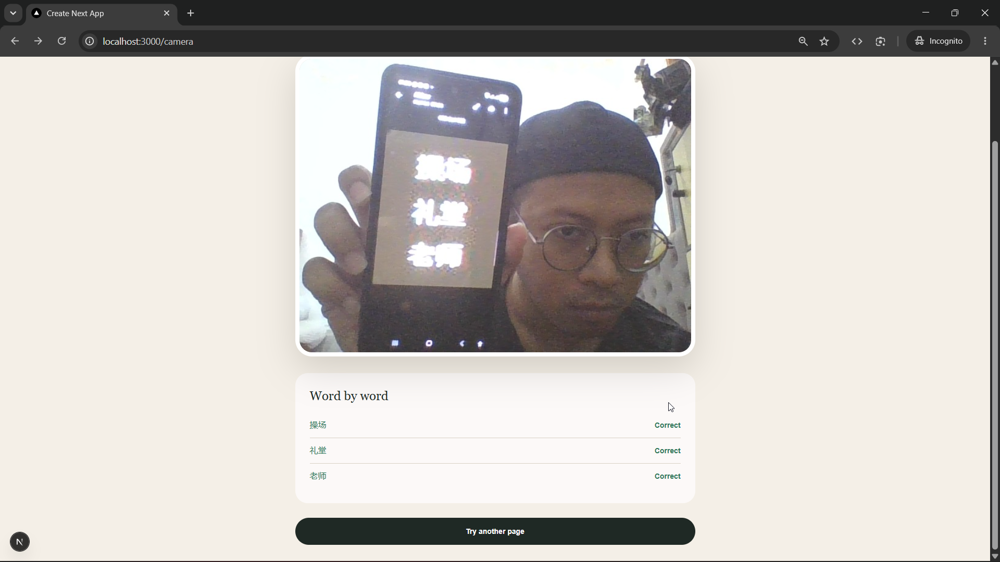
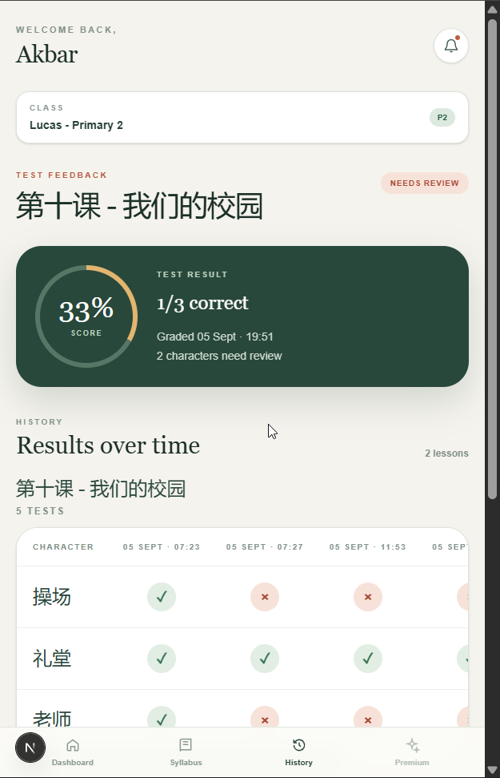

# TingXie HERO

Technical assignment for the Back-End Developer recruitment process.

> Status: Submission Ready
> Development Period: September 1-5, 2026

## Live Demo

https://technical-test-handrwiting-grading.vercel.app/

## Overview

TingXie HERO is a student-focused Chinese handwriting practice and
AI-assisted grading Progressive Web App.

The primary workflow is:

    Select Lesson
        |
    Capture Handwriting
        |
    Submit Image
        |
    AI-Assisted Recognition / Comparison
        |
    Application Validation & Scoring
        |
    Store Result
        |
    Display Score & Correction Feedback

The implementation prioritizes a complete, understandable grading flow rather
than claiming perfect handwriting-recognition accuracy.

## Application Preview

The main user flow is shown below, from lesson selection through grading
feedback and history.

| Dashboard | Syllabus |
| --- | --- |
|  |  |

| Camera / Handwriting Submission | Immediate Grading Feedback |
| --- | --- |
|  |  |

**Results History**

## Implemented Features

### Dashboard

- Assignment-aligned demo dashboard
- Student and progress presentation

### Syllabus

- Functional P1-P6 level selector
- URL-query-driven level state
- Live lessons loaded from Supabase
- Expandable lesson cards and vocabulary display
- Lesson-to-Camera navigation

### Camera

- Browser-native getUserMedia capture
- Rear/environment camera preference
- Capture preview and retake
- Upload to the server

### Backend

- POST /api/upload
- Server-side validation
- Private Supabase Storage
- Server-side Gemini communication
- Structured grading output and normalization
- Deterministic scoring
- Character-result and submission-score persistence

### Grading Feedback

- Immediate score
- Correct/incorrect character results
- Red correction annotations

### Results

- Persisted grading history from Supabase
- Historical result matrix

### PWA and Deployment

- Native manifest and application icons
- Installable PWA foundation
- Vercel deployment

Offline support and service-worker caching are intentionally not included.

## Final Architecture

    Browser
        |
    Next.js UI / Client Components
        |
    Next.js Route Handler
        |
    Server-Side Application Logic
        |
    Supabase Private Storage
        |
    Gemini
        |
    Application Validation / Normalization
        |
    Deterministic Scoring
        |
    Supabase PostgreSQL
        |
    Result UI / History

Privileged Supabase operations and Gemini communication remain server-side.
The browser receives application responses, not provider credentials or
privileged Supabase keys.

## Grading Design

lessons.word_list is the authoritative expected vocabulary. Gemini performs
recognition and comparison, but the application owns validation, normalization,
scoring, and persistence.

The application ignores invented words, preserves expected-word order, and
conservatively synthesizes omitted expected words as incorrect with no
recognized text. The score denominator remains the complete authoritative
lesson word list. Gemini does not calculate the final score.

## Gemini Configuration

GEMINI_API_KEY is required and is a server-side secret.

GEMINI_MODEL is optional and server-side. It defaults to gemini-3.5-flash and
allows model configuration to change without modifying grading application
logic. The selected model must support this pipeline's image input and
structured JSON response contract. There is no automatic model fallback.

## Local Setup

Install dependencies:

~~~bash
npm install
~~~

Copy the variable names from .example.env into the local environment and set
the appropriate values. Never commit secret values.

Start the development server:

~~~bash
npm run dev
~~~

## Environment Variables

From .example.env:

- SUPABASE_URL: server-side Supabase URL
- SUPABASE_PUBLISHABLE_KEY: publishable Supabase key
- SUPABASE_SECRET_KEY: server-only privileged key
- SUPABASE_JWKS_URL: Supabase JWKS configuration
- GEMINI_API_KEY: server-only Gemini secret
- GEMINI_MODEL: optional server-only model override; defaults to gemini-3.5-flash

The secret key variables must not use NEXT_PUBLIC_ names or be exposed to the
browser.

## Testing

~~~bash
npm test
npm run test:unit
npm run test:e2e
npm run lint
npm run build
~~~

Vitest covers deterministic application logic. Playwright covers the running
Next.js application, Route Handlers, and integration behavior.

## Known Limitations and Production Hardening

The assignment scope intentionally does not include:

- Authentication
- Per-user authorization and a complete ownership model
- Rate limiting and abuse prevention
- Offline service-worker grading

The current Supabase application tables have Row Level Security disabled. The
application uses server-side privileged operations for the primary workflow,
but a production deployment would require a complete authentication, ownership, RLS-policy, rate-limiting, and abuse-prevention design. RLS was not enabled during this assignment because policies must be designed for the eventual ownership model.

AI handwriting recognition is probabilistic, so accuracy is not guaranteed.
Correction annotations are UI-level feedback because the grading response does not contain OCR coordinates. The PWA foundation is installable but does not implement offline grading because grading depends on online services.

## AI-Assisted Engineering Workflow

The development workflow was:

    Requirement / Problem
        |
    Research & Architecture Discussion
        |
    Documentation / Technical Validation
        |
    Engineering Decision
        |
    Scoped Implementation with Codex
        |
    Code Review
        |
    Automated Testing
        |
    Manual Verification
        |
    Refinement when necessary

ChatGPT was used for requirement analysis, technical research assistance, architecture discussion, trade-off analysis, implementation review, and challenging assumptions. Codex was used for codebase exploration, scoped implementation assistance, refactoring, repetitive development work, and testing assistance.

Official documentation and technical references were consulted when unfamiliar or important framework and provider behavior required validation. AI-generated code and suggestions were treated as proposals, not automatically accepted solutions. The developer remained responsible for engineering decisions, understanding the architecture, reviewing code, manual verification, testing, and the final submission.
